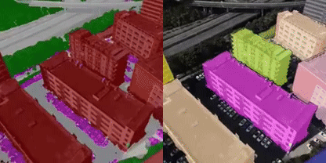

<p align="center">

  <h1 align="center">Aerial Lifting:
Neural Urban Semantic and Building Instance Lifting from Aerial Imagery</h1>
<p align="center">CVPR 2024</p>
  <p align="center">
    <a href="https://zyqz97.github.io/">Yuqi Zhang</a>
    ·
    <a href="https://guanyingc.github.io/">Guanying Chen</a>
    ·
    Jiaxing Chen
    ·
    <a href="https://sse.cuhk.edu.cn/faculty/cuishuguang">Shuguang Cui</a>
    
  </p>
  <h3 align="center">
    <a href="https://zyqz97.github.io/Aerial_Lifting/">Project Page</a>  
  <div align="center"></div>
</p>


<p align="center">
  <a href="">
    
  </a>
</p>

<p align="left">
We present a neural radiance field method for urban-scale semantic and building-level instance segmentation from aerial images by lifting noisy 2D labels to 3D.   
</p>
<be>


## Overview
This repository contains the following components to train Aerial Lifting:
1. Dataset processing scripts, including:
   1) far-view semantic label fusion;
   2) cross-view instance label grouping.
2. Training and evaluation scripts.

**Note:** This is a preliminary release and there may still be some bugs.


## Installation
### Create new conda env ([CUDA](https://developer.nvidia.com/cuda-toolkit-archive))
1. Clone this repo by:
  	```bash
  	git clone https://github.com/zyqz97/Aerial_lifting.git
   	```
2.  Create a conda environment (installation via [anaconda](https://www.anaconda.com/distribution/) is recommended.
    ```bash
    conda create -n aeriallift python=3.9
    conda activate aeriallift
    ```
3.  [pytorch-version](https://pytorch.org/get-started/previous-versions/)
    ```bash
    conda install pytorch==1.10.1 torchvision==0.11.2 torchaudio==0.10.1 cudatoolkit=11.3 -c pytorch -c conda-forge
   	```
4.  [tiny-cuda-nn](https://github.com/NVlabs/tiny-cuda-nn) and others
    ```bash
    pip install -r requirements.txt
    pip install git+https://github.com/NVlabs/tiny-cuda-nn/#subdirectory=bindings/torch
    ```
5. Install the extension of torch-ngp
    ```bash
    cd ./gp_nerf/torch_ngp/gridencoder
    python setup.py install
    cd ../raymarching
    python setup.py install
    cd ../shencoder
    python setup.py install
    ```

6. Follow the official [neuralsim](https://github.com/PJLab-ADG/neuralsim?tab=readme-ov-file#installation) to install nr3d_lib.

7. Install SAM 
    ```
    git clone https://github.com/facebookresearch/segment-anything.git
    cd segment-anything
    pip install -e .
    cd tools/segment_anything
    wget https://dl.fbaipublicfiles.com/segment_anything/sam_vit_h_4b8939.pth
    ```

### Tested environments
Ubuntu 20.04 with torch 1.10.1 & CUDA 11.3 on A100 GPU.


## Data Processing \& Training Step
* We take Yingrenshi dataset as an example. And you need to set  'dataset_path=$YOURPATH/Aerial_lifting_data/Yingrenshi' and 'config_file=configs/yingrenshi.yaml'.


* We also provide the processed data in the next section. The training scripts (Step 1.1, Step 2.4, and Step 3.3) can be run directly if you download the processed data.


### Step 1. Training Geometry
* #### 1.1 Train the geometry field.
  ```shell
  sh bash/train_geo.sh
  ```
  Note: $exp_name denotes the logs_saving path (e.g. exp_name=logs/train_geo_yingrenshi)

### Step 2. Training Semantic Field

* #### 2.1 Get Mask2former semantic labels
  For generating semantic labels of Mask2former, please use our modified version of Mask2former from [here](https://github.com/zyqz97/AerialLifting_Mask2Former). You need to create a new conda env.
  This code is largely based on [MaskFormer](https://github.com/facebookresearch/MaskFormer) and a modified version of [Panapti-Lifting](https://github.com/nihalsid/Mask2Former).

  After installing the environment of Mask2former:
  ```shell
  sh bash/2_1_m2f_labels.sh
  ```

* #### 2.2 Render far-view RGB images from the checkpoint of Step 1.
  ```shell
  sh bash/2_2_get_far_view_images.sh
  ```

  Note: need to specify $M2F_path, $exp_name, $ckpt_path
* #### 2.3 Get fusion semantic label.
  ```shell
  sh bash/2_3_fusion.sh
  ```

* #### 2.4 Train the semantic field.
  After processing or downloading the data, you can use the script below to train the semantic field.
  
  ```shell
  sh bash/train_semantic.sh
  ```


### 3. Training Instance Field
* #### 3.1 Generate the SAM instance mask with geo-filter
  ```shell
  sh bash/3_1_get_sam_mask_depth_filter.sh
  ```
* #### 3.2 Generate the cross-view guidance map
  ```shell
  sh bash/3_2_cross_view_process.sh
  ```
  
* #### 3.3 Train the instance field.
  After processing or downloading the data, you can use the script below to train the instance field.
  ```shell
  sh bash/train_instance.sh
  ```


## Processed Dataset & Trained Models.
Download the [processed data](https://cuhko365-my.sharepoint.com/:f:/g/personal/222010022_link_cuhk_edu_cn/EvtJd9VXQ9dHgtxXRWQQ92UB8f1BdxXenhu9bPnI19sgcQ?e=2JuPEa) and [trained checkpoints](https://cuhko365-my.sharepoint.com/:f:/g/personal/222010022_link_cuhk_edu_cn/Ev6nwVGSIw9Ls8bi-5GlCOYBU53R2I251ibT4stkMWLBHA?e=ALFOUl).


We thank the authors for providing the datasets. If you find the datasets useful in your research, please cite the papers that provided the original aerial images:
```shell
@inproceedings{UrbanBIS,
title = {UrbanBIS: a Large-scale Benchmark for Fine-grained Urban Building Instance Segmentation},
author = {Guoqing Yang and Fuyou Xue and Qi Zhang and Ke Xie and Chi-Wing Fu and Hui Huang},
booktitle = {SIGGRAPH},
year = {2023},
}

@inproceedings{UrbanScene3D,
title={Capturing, Reconstructing, and Simulating: the UrbanScene3D Dataset},
author={Liqiang Lin and Yilin Liu and Yue Hu and Xingguang Yan and Ke Xie and Hui Huang},
booktitle={ECCV},
year={2022},
}

```

## Citation
If you find this work useful for your research and applications, please cite our paper:
```shell
@inproceedings{zhang2024aerial,
  title={Aerial Lifting: Neural Urban Semantic and Building Instance Lifting from Aerial Imagery},
  author={Zhang, Yuqi and Chen, Guanying and Chen, Jiaxing and Cui, Shuguang},
  booktitle={CVPR},
  year={2024}
}
```

## Acknowledgements
Large parts of this codebase are based on existing work in the [Mega-NeRF](https://github.com/cmusatyalab/mega-nerf), [torch-ngp](https://github.com/ashawkey/torch-ngp), [neuralsim](https://github.com/PJLab-ADG/neuralsim), [Panoptic-Lifting](https://github.com/nihalsid/panoptic-lifting), [Contrastive-Lift](https://github.com/yashbhalgat/Contrastive-Lift), [SAM](https://github.com/facebookresearch/segment-anything), [Mask2Former](https://github.com/facebookresearch/Mask2Former). We thank the authors for releasing their code.


